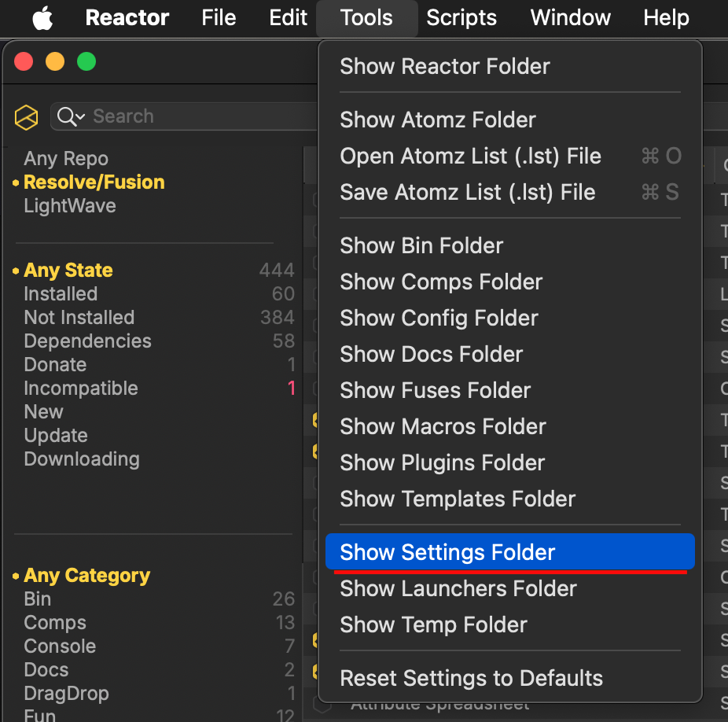

# Advanced Reactor Usage

## Reactor Standalone Preferences

The Reactor Standalone preferences are stored in a JSON document.

On macOS the JSON file can be found at:  
`$HOME/Library/Application Support/Reactor/Reactor.json`

On Windows the JSON file can be found at:  
`C:\Users\<Your User Account>\AppData\Roaming\Reactor.json`

On Linux the JSON file can be found at:  
`$HOME/.config/Reactor/Reactor.json`

This folder can be accessed using the "File > Show Settings Folder" menu item in Reactor Standalone.



The Reactor.json file is formatted like:

```
{
    "MainWindow": {
        "Top": 53,
        "Left": 0,
        "Width": 1356,
        "Height": 768
    },
    "LicenseAccepted": true,
    "InfobarEventDetails": 3,
    "GamepadSupport": 0,
    "LiveSearch": false,
    "NewForDays": 30,
    "MarkAsNew": true,
    "ReactorInstallPathMap": "/Users/vfx/Reactor/",
    "Repos": {
        "_Core": {
            "Name": "Reactor",
            "Protocol": "GitLab",
            "Software": "Fusion",
            "LocalFile": "Reactor.json",
            "DeployFolder": "Deploy",
            "BaseURL": "https://gitlab.com/WeSuckLess/Reactor/-/blob/master/Atoms/",
            "URL": "https://gitlab.com/WeSuckLess/Reactor/-/raw/master/JSON/Reactor.json?ref_type=heads",
            "ZIPFilePrefix": "Reactor-master-Atoms-",
            "Highlights": {
                "Name": "Reactor Highlights",
                "LocalFile": "Highlights.json",
                "URL": "https://gitlab.com/WeSuckLess/Reactor/-/raw/master/JSON/Highlights.json?ref_type=heads"
            }
        },
        "_LW": {
            "Name": "Reactor",
            "Protocol": "GitLab",
            "Software": "LightWave",
            "LocalFile": "Reactor.json",
            "DeployFolder": "DeployLW",
            "BaseURL": "https://gitlab.com/WeSuckLess/Reactor-for-LightWave/-/blob/main/Atoms/",
            "URL": "https://gitlab.com/WeSuckLess/Reactor-for-LightWave/-/raw/main/JSON/Reactor.json?ref_type=heads",
            "ZIPFilePrefix": "Reactor-for-LightWave-main-Atoms-",
            "Highlights": {
                "Name": "Reactor Highlights",
                "LocalFile": "Highlights.json",
                "URL": "https://gitlab.com/WeSuckLess/Reactor-for-LightWave/-/raw/main/JSON/Highlights.json?ref_type=heads"
            }
        }
    }
}
```

If you want to change the location where atom packages are sourced from, you can modify the "Repos / _Core" attributes in the JSON file. Here is an example where Vonk Ultra repo atoms are accessed in Reactor Standalone:

```
{
    "MainWindow": {
        "Top": 53,
        "Left": 0,
        "Width": 1400,
        "Height": 680
    },
    "LicenseAccepted": true,
    "GamepadSupport": 1,
    "LiveSearch": false,
    "NewForDays": 30,
    "MarkAsNew": true,
    "ReactorInstallPathMap": "/Users/vfx/Reactor/",
    "Repos": {
        "_Core": {
            "Name": "Reactor",
            "Protocol": "GitLab",
            "LocalFile": "Reactor.json",
            "BaseURL": "https://gitlab.com/AndrewHazelden/Vonk/-/blob/master/Atoms/",
            "URL": "https://gitlab.com/AndrewHazelden/Vonk/-/raw/master/JSON/Reactor.json?ref_type=heads",
            "ZIPFilePrefix": "Vonk-master-Atoms-"
            "Highlights": {
                "Name": "Reactor Highlights",
                "LocalFile": "Highlights.json",
                "URL": "https://gitlab.com/WeSuckLess/Reactor/-/raw/master/JSON/Highlights.json?ref_type=heads"
            }
        }
    }
}
```

## Reactor URL Link Format

The new Reactor standalone application registers itself system-wide as a custom URL handler for clickable URLs that are formatted as "Reactor:/<AtomID>". This makes installing atom packages a breeze. Simply clicking a Chrome/Firefox/Safari webpage or forum link can automatically launch the Reactor.app program and bring you right to the desired atom package's description.

### Sample Reactor Weblinks

- [Install the KAK Atom Package](Reactor:/com.PieterVanHoute.KAK)  
- [Install the KickAss ShaderZ Atom Package](Reactor:/com.wesuckless.KickAssShaderZ)  
- [Install the KKD Atom Package](Reactor:/com.KomKomDoorn.krokodoveFu19)  

BBCode:

```
[url=Reactor:/com.PieterVanHoute.KAK]Install the KAK Atom Package[/url]
[url=Reactor:/com.wesuckless.KickAssShaderZ]Install the KickAss ShaderZ Atom Package[/url]
[url=Reactor:/com.KomKomDoorn.krokodoveFu19]Install the KKD Atom Package[/url]
```

HTML:

```
<a href="Reactor:/com.PieterVanHoute.KAK">Install the KAK Atom Package</a>
<a href="Reactor:/com.wesuckless.KickAssShaderZ">Install the KickAss ShaderZ Atom Package</a>
<a href="Reactor:/com.KomKomDoorn.krokodoveFu19">Install the KKD Atom Package</a>
```

Markdown:

```
[Install the KAK Atom Package](Reactor:/com.PieterVanHoute.KAK)
[Install the KickAss ShaderZ Atom Package](Reactor:/com.wesuckless.KickAssShaderZ)
[Install the KKD Atom Package](Reactor:/com.KomKomDoorn.krokodoveFu19)
```
