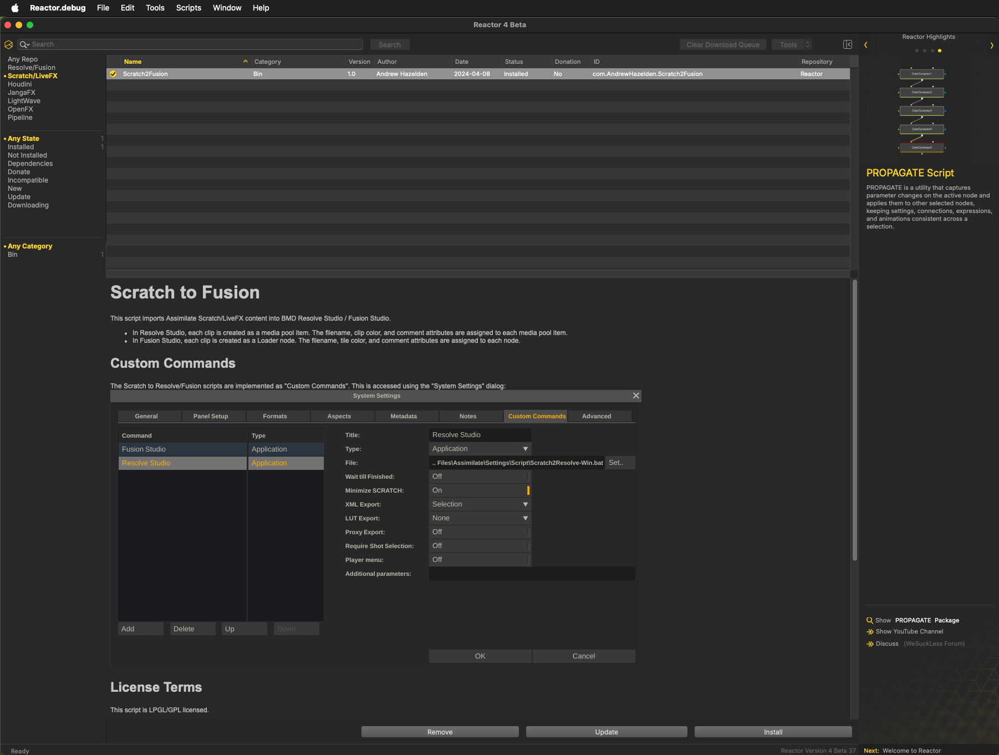

# Reactor for Assimilate Usage

Reactor Standalone now supports Assimilate Scratch/LiveFX. You can access the packages in Reactor Standalone by clicking on the words "Scratch/LiveFX" that is accessible at the top of the Left Panel.

The GitLab repository that hosts the Reactor for Assimilate atom packages is located at:  
[https://gitlab.com/WeSuckLess/Reactor-for-Assimilate](https://gitlab.com/WeSuckLess/Reactor-for-Assimilate)

## Screenshot

## Reactor Downloads Folder

With Reactor 4, the default "Reactor" folder location has changed so it points to the content that is stored in your user account's home folder at:

`$HOME/Reactor/`

Reactor Standalone downloads the Assimilate compatible content to the sub-folder located at:

`Reactor:/DeployAssimilate/`
