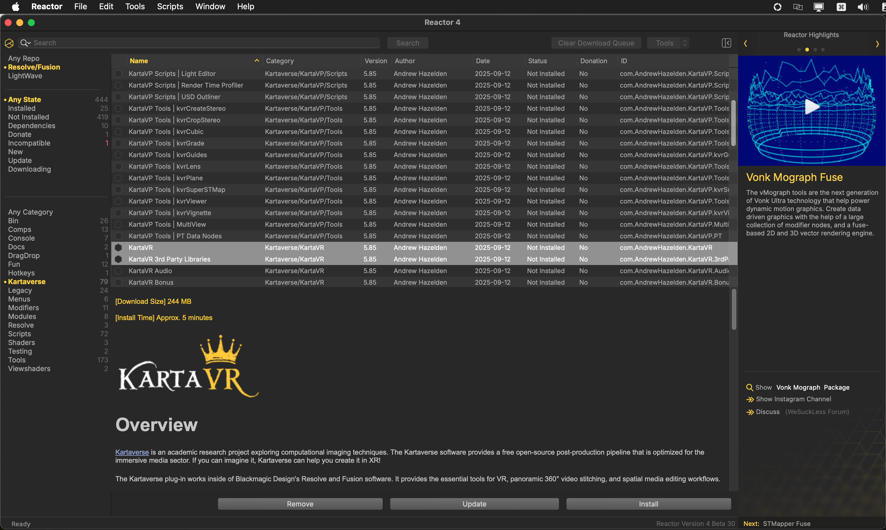
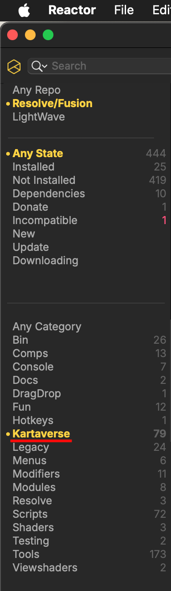
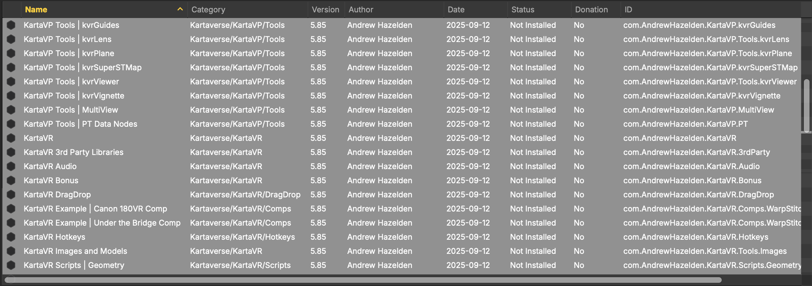

# Reactor Standalone Beta Testing

## Overview

After several months of development, Reactor 4 is now available as a standalone desktop application for macOS/Windows/Linux systems.

Reactor is a package manager created by the We Suck Less Community for Fusion and Resolve. Reactor streamlines the installation of 3rd party content through the use of "Atom" packages that are synced automatically with a Git repository.

The Reactor Package Manager allows you to easily install/update/remove 3rd party community made content. This simplifies the installation process and makes it possible to keep everything up to date. The Reactor toolset works with Blackmagic Design's Resolve Free, Resolve Studio, Fusion Studio, and Fusion Render Node software.

Among other things, Reactor is the way [KartaVR/Kartaverse](https://github.com/Kartaverse) is installed.

## Reactor Installation

The Reactor docs cover the installation process for macOS/Windows/Linux.

Note: It's helpful to be running your OS in "Dark Mode" if you are looking at the Reactor Standalone app's "Preference" window in the current beta builds. I am working on adjusting the text color in this window to solve the contrast issues.

## Reactor Testing Procedure

### Step 1. If you have a chance to test the Reactor 4 program, what I'd like help with is if you could select the "Kartaverse" category on the left sidebar of the Reactor program. 

Then click on the name of one of the packages in the list panel at the top center of the user interface to select it. 

Use the "Edit > Select All" menu item, or the Select All (Control + A) hotkey to select all the packages in this view.

When all the packages are selected the list panel will look like this:

Click the "Install" button at the lower right of the user interface. This will tell Reactor to start installing each of the selected packages in an automated fashion.

It would be very helpful if you could time things to roughly see how long it takes for the installation process to complete and note if there are any errors. When a package is installed you will see a small yellow checkbox next to the item's name.

### Step 2. If everything works as expected you should have a full Kartaverse install in a few minutes. 

I assume this package installation process will run about 5 times faster than the older edition of Reactor 3 that was run from inside of Resolve using the Blackmagic native scripting APIs.

## Closing Thoughts

Thanks for your beta testing assistance. Having help from the immersive community is greatly appreciated. 🙏

