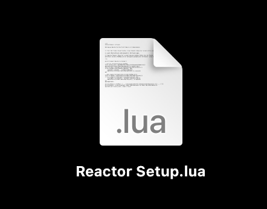
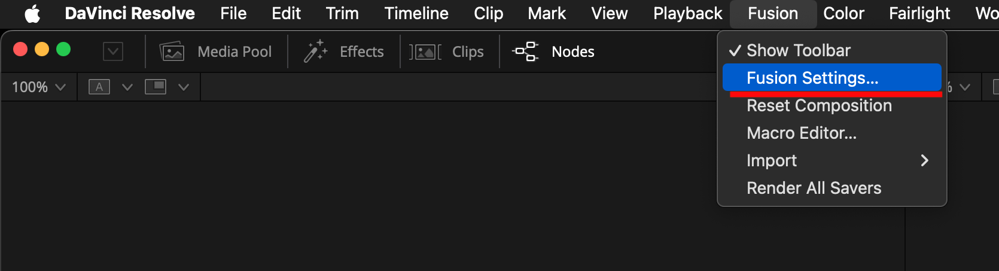

# Reactor Standalone Beta Testing

## Overview

After several months of development, Reactor 4 is now available as a standalone desktop application for macOS/Windows/Linux systems.

Reactor is a package manager created by the We Suck Less Community for Fusion and Resolve. Reactor streamlines the installation of 3rd party content through the use of "Atom" packages that are synced automatically with a Git repository.

The Reactor Package Manager allows you to easily install/update/remove 3rd party community made content. This simplifies the installation process and makes it possible to keep everything up to date. The Reactor toolset works with Blackmagic Design's Resolve Free, Resolve Studio, Fusion Studio, and Fusion Render Node software.

Among other things, Reactor is the way [KartaVR/Kartaverse](https://github.com/Kartaverse) is installed.

## Development Todo List

The following features will be completed before the official release ships:

- Make folder creation permission errors graceful
- Improve Windows download queue task handling with synchronous downloads. Right now asynchronous downloads are used at a per-atom file transfer level which is blocking and reduces the interactivity of the UI.

## Beta Resources

You can download the latest Reactor Standalone beta builds from the [Google Drive folder here](https://drive.google.com/drive/folders/1Cj_wo7CKmdOhORudgXWiZTAcWQlSvpjE).

## Reactor Installation

The Reactor ReadMe guide covers the installation process for macOS/Windows/Linux.

Note: It's helpful to be running your OS in "Dark Mode" if you are looking at the Reactor Standalone app's "Preference" window in private beta build 23. I am working now on another recompile that will adjust the text color in this window to solve the contrast issues.

## Reactor Testing Procedure

### Step 1. If you have a chance to test the Reactor 4 program, what I'd like help with is if you could select the "Kartaverse" category on the left sidebar of the Reactor program. 

Then click on the name of one of the packages in the list panel at the top center of the user interface to select it. 

Use the "Edit > Select All" menu item, or the Select All (Control + A) hotkey to select all the packages in this view.

When all the packages are selected the list panel will look like this:

Click the "Install" button at the lower right of the user interface. This will tell Reactor to start installing each of the selected packages in an automated fashion.

It would be very helpful if you could time things to roughly see how long it takes for the installation process to complete and note if there are any errors. When a package is installed you will see a small yellow checkbox next to the item's name.

### Step 2. If everything works as expected you should have a full Kartaverse install in a few minutes. (I assume this package installation process will run about 5 times faster than the older edition of Reactor 3 that was run from inside of Resolve using the Blackmagic native scripting APIs.)

After the content is downloaded, go to Reactor's "File > Connect Reactor to Fusion…" menu item.

Follow the instructions in this dialog to make the Reactor downloaded content show up inside of DaVinci Resolve/Fusion.

Click the "Create Script" button. A file named "Reactor Setup.lua" will be created on your computer's desktop folder. Open this folder up in a desktop folder browsing window.

Start the Davinci Resolve/Fusion program. Navigate into an existing editing project. Then open up the "Workspace > Console" menu item.

The Console window will appear. This is the view where Lua and Python scripts can be run, by dragging them from the Desktop folder into the Console window.

Drag the following Lua script file from your desktop folder into the Console window to run it. You may have to re-open the Console window again after running the scripts to see the result.

If the setup process was successful the Console window will show the following message:

Quit DaVinci Resolve/Fusion. Then re-launch the software. You should now have Kartaverse installed on your system. 

The "Reactor Setup.lua" script created what is called a Fusion Pathmap setting that tells DaVinci Resolve where to find the Reactor content. It points the PathMap shortcut called "Reactor:" to the location on the disk where the files were downloaded to.

If you want to see where the PathMap setting was configured in the program's settings, open up DaVinci Resolve's Fusion page. Navigate to the "Fusion > Fusion Settings…" menu.

Then on the left sidebar select the "PathMap" entry. Scroll down in the main part of the view to the bottom of the list. You will see the User section where the "Reactor:" entry is defined. Also in the "UserPaths:", and "Scripts:" sections of the dialog the Reactor entry is referenced.

## Closing Thoughts

Thanks for your beta testing assistance. Having help from the immersive community is greatly appreciated. 🙏

