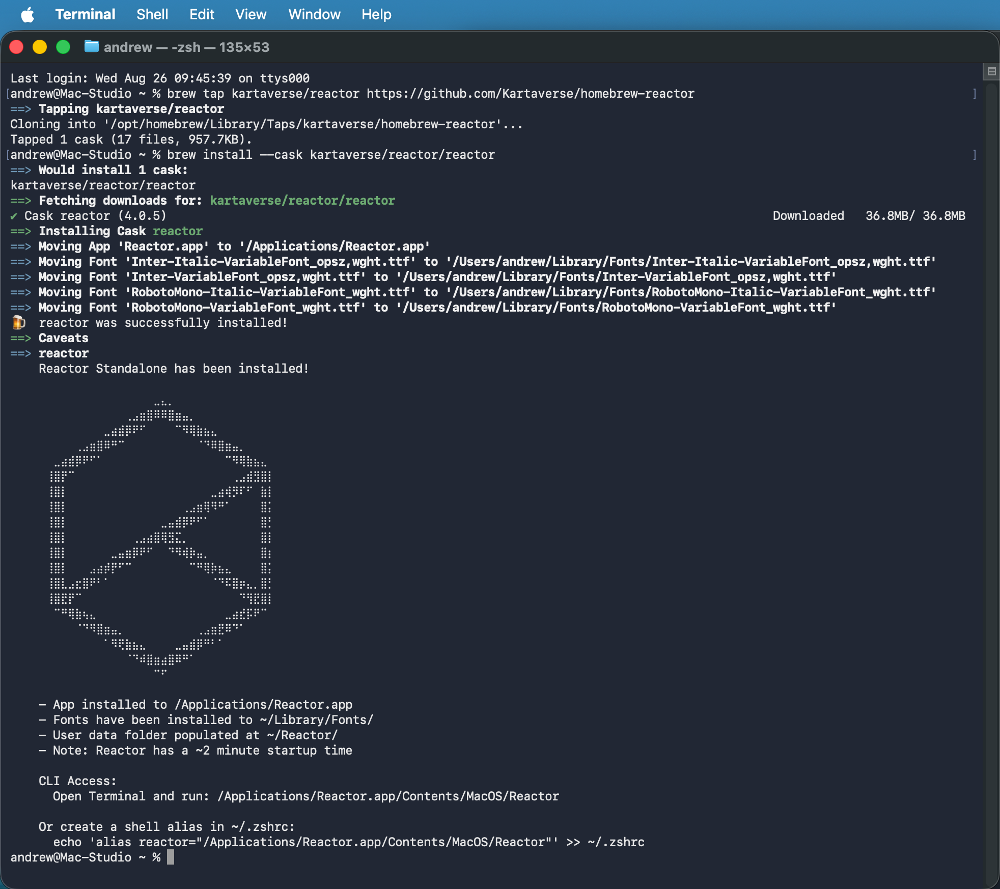

# Homebrew Reactor Standalone Cask

A [Homebrew](https://brew.sh/) tap for the [Reactor Standalone](https://github.com/Kartaverse/Reactor-Standalone) package manager on macOS now exists in the [homebrew-reactor](https://github.com/Kartaverse/homebrew-reactor) repo.



## Install

The Homebrew package manager for macOS is installed using the terminal command:

```bash
/bin/bash -c "$(curl -fsSL https://raw.githubusercontent.com/Homebrew/install/HEAD/install.sh)"
```

Reactor Standalone can then be installed using Homebrew's "brew" CLI tool:

```bash
brew tap kartaverse/reactor https://github.com/Kartaverse/homebrew-reactor
brew install --cask kartaverse/reactor/reactor
```

If you need more detailed information for the brew install process you can run:

```bash
brew install --cask --verbose --debug kartaverse/reactor/reactor
```

## Brew Status Info

If the Reactor Standalone install process was successfull using brew, the terminal window should display the following details:

```
% brew tap kartaverse/reactor https://github.com/Kartaverse/homebrew-reactor
==> Tapping kartaverse/reactor
Cloning into '/opt/homebrew/Library/Taps/kartaverse/homebrew-reactor'...
Tapped 1 cask (17 files, 957.7KB).
% brew install --cask kartaverse/reactor/reactor
==> Would install 1 cask:
kartaverse/reactor/reactor
==> Fetching downloads for: kartaverse/reactor/reactor
✔︎ Cask reactor (4.0.5)                                                                                     Downloaded   36.8MB/ 36.8MB
==> Installing Cask reactor
==> Moving App 'Reactor.app' to '/Applications/Reactor.app'
==> Moving Font 'Inter-Italic-VariableFont_opsz,wght.ttf' to '/Users/andrew/Library/Fonts/Inter-Italic-VariableFont_opsz,wght.ttf'
==> Moving Font 'Inter-VariableFont_opsz,wght.ttf' to '/Users/andrew/Library/Fonts/Inter-VariableFont_opsz,wght.ttf'
==> Moving Font 'RobotoMono-Italic-VariableFont_wght.ttf' to '/Users/andrew/Library/Fonts/RobotoMono-Italic-VariableFont_wght.ttf'
==> Moving Font 'RobotoMono-VariableFont_wght.ttf' to '/Users/andrew/Library/Fonts/RobotoMono-VariableFont_wght.ttf'
🍺  reactor was successfully installed!
==> Caveats
==> reactor
    Reactor Standalone has been installed!
    
⠀⠀⠀⠀⠀⠀⠀⠀⠀⠀⠀⠀⠀⠀⠀⠀⠀⠀⠀⠀⣀⣄⡀⠀⠀⠀⠀⠀⠀⠀⠀⠀⠀⠀⠀⠀⠀
⠀⠀⠀⠀⠀⠀⠀⠀⠀⠀⠀⠀⠀⠀⠀⠀⢀⣠⣶⣿⠿⠿⣿⣶⣤⡀⠀⠀⠀⠀⠀⠀⠀⠀⠀⠀⠀
⠀⠀⠀⠀⠀⠀⠀⠀⠀⠀⠀⠀⠀⣀⣴⣾⡿⠟⠋⠀⠀⠀⠀⠉⠻⢿⣷⣦⣄⠀⠀⠀⠀⠀⠀⠀⠀
⠀⠀⠀⠀⠀⠀⠀⠀⠀⢀⣠⣶⣿⠿⠛⠉⠀⠀⠀⠀⠀⠀⠀⠀⠀⠀⠈⠙⠿⣿⣶⣤⡀⠀⠀⠀⠀
⠀⠀⠀⠀⠀⠀⣀⣴⣾⡿⠟⠋⠁⠀⠀⠀⠀⠀⠀⠀⠀⠀⠀⠀⠀⠀⠀⠀⠀⠀⠉⠻⢿⣷⣦⣄⠀
⠀⠀⠀⠀⠀⢸⣿⡟⠉⠀⠀⠀⠀⠀⠀⠀⠀⠀⠀⠀⠀⠀⠀⠀⠀⠀⠀⠀⠀⠀⠀⢀⣠⣾⣻⣿⡇
⠀⠀⠀⠀⠀⢸⣿⡇⠀⠀⠀⠀⠀⠀⠀⠀⠀⠀⠀⠀⠀⠀⠀⠀⠀⠀⠀⠀⣀⣴⢾⡻⠏⠋⠀⣷⡇
⠀⠀⠀⠀⠀⢸⣿⡇⠀⠀⠀⠀⠀⠀⠀⠀⠀⠀⠀⠀⠀⠀⠀⠀⢀⣠⣶⢿⠻⠛⠁⠀⠀⠀⠀⣿⡅
⠀⠀⠀⠀⠀⢸⣿⡇⠀⠀⠀⠀⠀⠀⠀⠀⠀⠀⠀⠀⠀⣀⣤⣾⡿⠟⠋⠁⠀⠀⠀⠀⠀⠀⠀⣿⡃
⠀⠀⠀⠀⠀⢸⣿⡇⠀⠀⠀⠀⠀⠀⠀⠀⠀⢀⣠⣴⣿⢿⣻⣍⡀⠀⠀⠀⠀⠀⠀⠀⠀⠀⠀⣿⡇
⠀⠀⠀⠀⠀⢸⣿⡇⠀⠀⠀⠀⠀⠀⣀⣤⣶⡿⠟⠋⠀⠀⠙⠻⢾⡷⣤⡀⠀⠀⠀⠀⠀⠀⠀⣿⡆
⠀⠀⠀⠀⠀⢸⣿⡇⠀⠀⠀⣠⣴⡾⡟⠋⠉⠀⠀⠀⠀⠀⠀⠀⠀⠉⠛⢿⡷⣦⣄⠀⠀⠀⠀⣿⡅
⠀⠀⠀⠀⠀⢸⣿⣇⣠⣖⣿⠟⠃⠁⠀⠀⠀⠀⠀⠀⠀⠀⠀⠀⠀⠀⠀⠀⠈⠙⠯⣿⡶⣄⡀⣿⡃
⠀⠀⠀⠀⠀⢸⣿⣟⡟⠉⠀⠀⠀⠀⠀⠀⠀⠀⠀⠀⠀⠀⠀⠀⠀⠀⠀⠀⠀⠀⠀⠀⠙⢻⣟⣿⡇
⠀⠀⠀⠀⠀⠀⠉⠛⢿⣷⢦⣄⠀⠀⠀⠀⠀⠀⠀⠀⠀⠀⠀⠀⠀⠀⠀⠀⠀⠀⣀⣴⣞⡯⠟⠉⠀
⠀⠀⠀⠀⠀⠀⠀⠀⠀⠈⠙⠻⣿⣶⣤⡀⠀⠀⠀⠀⠀⠀⠀⠀⠀⠀⢀⣠⣶⣟⠿⠙⠁⠀⠀⠀⠀
⠀⠀⠀⠀⠀⠀⠀⠀⠀⠀⠀⠀⠀⠁⠻⢟⣷⣦⣄⠀⠀⠀⠀⣀⣤⣾⡿⠛⠃⠁⠀⠀⠀⠀⠀⠀⠀
⠀⠀⠀⠀⠀⠀⠀⠀⠀⠀⠀⠀⠀⠀⠀⠀⠈⠙⠾⣿⣶⣴⣿⠿⠛⠁⠀⠀⠀⠀⠀⠀⠀⠀⠀⠀⠀
⠀⠀⠀⠀⠀⠀⠀⠀⠀⠀⠀⠀⠀⠀⠀⠀⠀⠀⠀⠀⠉⠋⠀⠀⠀⠀⠀⠀⠀⠀⠀⠀⠀⠀⠀⠀⠀

    - App installed to /Applications/Reactor.app
    - Fonts have been installed to ~/Library/Fonts/
    - User data folder populated at ~/Reactor/
    - Note: Reactor has a ~2 minute startup time

    CLI Access:
      Open Terminal and run: /Applications/Reactor.app/Contents/MacOS/Reactor

    Or create a shell alias in ~/.zshrc:
      echo 'alias reactor="/Applications/Reactor.app/Contents/MacOS/Reactor"' >> ~/.zshrc
```

## Uninstall

To remove Reactor Standalone and untap the repository:

```bash
brew uninstall --cask kartaverse/reactor/reactor
brew untap kartaverse/reactor
```
