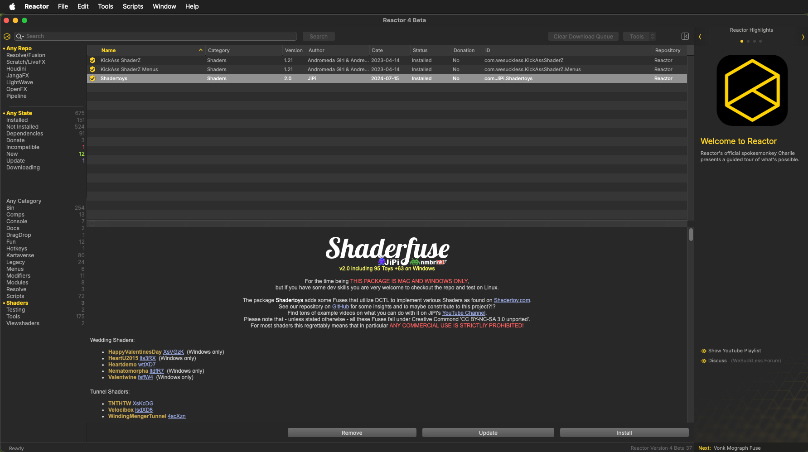
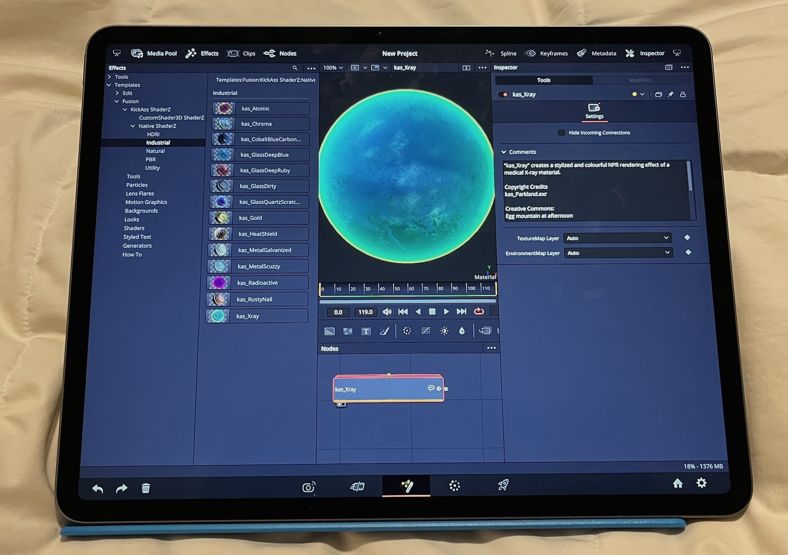

# Reactor Anywhere&trade; v5.0

> Reactor Roadmap (2026-09-21)  
> Written by: [Andrew Hazelden](mailto:andrew@andrewhazelden.com)  

What would it look like if you could have the identical “Reactor Package Manager” user experience but access it purely via a web browser hosted [Progressive Web App (PWA)](https://en.wikipedia.org/wiki/Progressive_web_app) session that still retained the best parts of the Reactor app-like user interface? A design concept emerged for the next evolution of the WSL Fusion Community-based [Reactor project](https://gitlab.com/WeSuckLess/Reactor).

## Overview

Reactor staff work hard every day in our long-term quest to fully support the ~500K plus active users of the Reactor Package Manager and its included content and learning resources. At the moment, that means supporting the two unique software interfaces used via [Reactor Classic](https://gitlab.com/WeSuckLess/Reactor) / [Reactor Standalone](https://github.com/Kartaverse/Reactor-Standalone). 

We continuously put our best efforts and ideas into action with the Reactor project today, tomorrow, during rough weather that feels like [the day-after-tomorrow](https://www.youtube.com/watch?v=HUBDFoMNXzA), and the time beyond that, by delivering the "extended" Fusion community-made content to the web in new ways. This requires us to keep moving forward, adopt new Reactor application designs, and roll out ever-improving download mechanisms.

Additionally, over the last year and a bit, Reactor's core repository management functionality expanded to work with the latest Resolve/Fusion release. We added the capacity to serve broader creative software spaces like [Assimilate Scratch and LiveFX](https://gitlab.com/WeSuckLess/Reactor-for-Assimilate), [OpenFX](https://gitlab.com/WeSuckLess/Reactor-for-OpenFX), [JangaFX](https://gitlab.com/WeSuckLess/Reactor-for-JangaFX), [SideFX Houdini](https://gitlab.com/WeSuckLess/Reactor-for-Houdini), [LightWave](https://gitlab.com/WeSuckLess/Reactor-for-LightWave), and even for VFX/XR/Media production [Pipelines](https://gitlab.com/WeSuckLess/Reactor-for-Pipelines), too.

(Click to play the YouTube Video)

## The Reactor Web App Concept and why it's Probably Needed ASAP

The concept behind the new Reactor Anywhere repo effort is to create the next generation of web-browser session-operated Reactor tools with responsive, slick, well-thought-out user interfaces that react automatically to the active device used to view the Reactor web app.

This app redesign process will allow the end user to entirely skip the need to install a [Reactor Standalone](https://github.com/Kartaverse/Reactor-Standalone) desktop application locally on a laptop or workstation. And it further builds on the base 2018 version of Reactor that we all know and love. 

That original WSL Reactor edition is today known colloquially as "Reactor Classic", as it uses a [Reactor.lua](https://gitlab.com/WeSuckLess/Reactor/-/blob/master/System/Reactor.lua?ref_type=heads) file and the BMD UI Manager API that both require “advanced” LuaJIT scripting capabilities to exist in the host Resolve Studio / Fusion Studio DCC application.

This advanced scripting support was previously a feature in the Freemium Fusion Free v7 to v9.0.2, and Resolve Free v15 to v19.0.3 programs. 

## What will the new Reactor WebUI look like?

With the upcoming Reactor Anywhere release, it will feel a lot like a supercharged, fast, browser based remake of Reactor Standalone's existing UI. Gone are the initial Reactor Standalone beta application's pokey startup times, slow atom package syncing speed, and extra lag (short delay) when switching categories and clicking around in the user interface. 

We want Reactor Anywhere to set a newly improved standard of running smooth-as-butter. That is the major goal for the web-hosted experience, as you navigate your way across the full Reactor user interface.

We plan to take the best parts of the Reactor Classic / Reactor Standalone user interface elements and carry them forward with modern [Progressive Web App (PWA)](https://en.wikipedia.org/wiki/Progressive_web_app) technology.

Here is what the current Reactor Standalone desktop app user interface looks like for reference: 

## Reactor-Anywhere for iPad (Resolve Studio for iPad Compatible)

With Reactor Anywhere, you will be able to run the Reactor WebUI on an iPad's Safari or Chrome web browser. 

You can download your favourite packaged content. Then the "Files" app will allow you to install the Atom packaged content that makes sense to use with [Resolve Studio for iPad](https://apps.apple.com/us/app/davinci-resolve-for-ipad/id1581363826). Now, how cool is that?

A special Reactor Anywhere compatible version of the "[KAS shaders](https://kartaverse.github.io/Reactor-Docs/#/com.wesuckless.KickAssShaderZ?id=kickass-shaderz)" atom package is also being prepared so it can run in a modified form on "Resolve Studio v21 for iPad". This finally brings the classic material library to tablet-based 3D artists.

To help support the upcoming rollout of the KAS shaders on iPad, here is a draft copy of the Reactor-Anywhere for iPad [Atomz Package User’s Guide](https://docs.google.com/document/d/13DvFL55PZQ85jfIDDGERpa2hAaThXyuqCQNMt4mKfUQ/edit?usp=drivesdk). The KAS for iPad initial release is planned for tomorrow (pending the actual time availability on the day to manage the full launch effort 🚀).

## What Atom Content Will Reactor Anywhere Support Initially?

The new JSON-based Reactor atom package will allow you install file formats like:

Content:
- Macros (.setting)
- DCTLs (.dctl)
- LUTS
- Audio
- Movies
- RAW Video Formats
- Images / Image Sequences
- ST Map Warping Templates
- Lens Distort (.data)
- Camera Tracking Data (.lws, .ase, .ma)
- Point Clouds (.lws, .ase, .ma)
- 3D Geometry
- Resolve:
	- Projects (.dra, .drp)
	- Timelines (.drt)
	- Bins (.drb)
	- Grades (.drx)
- Fusion:
	- Composites (.comp)
	- Polyline Roto Shape Data (.dfsh, .ssf, .fxs, .nuke, .nk)
	- Custom PathMaps
	- Custom Variable Maps
	- Custom Toolbars
	- Custom Guide Grids .guide
	- Confg Files (.fu, .zfu) based Menus/Hotkeys/Events/Actions
	- Fusion Render Manager Queues (.dfq)

Mograph:
- Effects Templates (.drfx, .setting)
- OGraf (.json)
- Lottie (.lottie)
- Fonts (.ttf, etc…)
- JSON (.json, .jsonc)
- Spreadsheets (.csv, .tsv, .xls, etc.)

Plugins:
- Fuses (.fuse)
- FusionSDK C+ (.plugin)
- OpenFX C++ Plugin Bundle
- Workflow Integrations / Deliver Page Exporters
- VST Audio Plugin (.vst)

# Reactor File System

Want to have your mind blown just a bit further, on all of the new Reactor-Anywhere potential? 🤯

Here is a Google Docs hosted file that explores the finer details around a [Reactor Virtual File Systems (VFS)](ReactorAtomzVirtualFileSystem.md) concept. The resource tries to summarize the exciting but technical parts, and explain how this community project can make Reactor-Anywhere feel just like you are using Google Drive or Apple iCloud.

# Closing Thoughts

The future for Reactor looks very exciting today.

There is always something new and nifty being prepared in the lab. Thanks for being on this journey with the Reactor team. It really is a global community effort that keeps things moving and creates the magic of the atom packages we all enjoy and build together.

