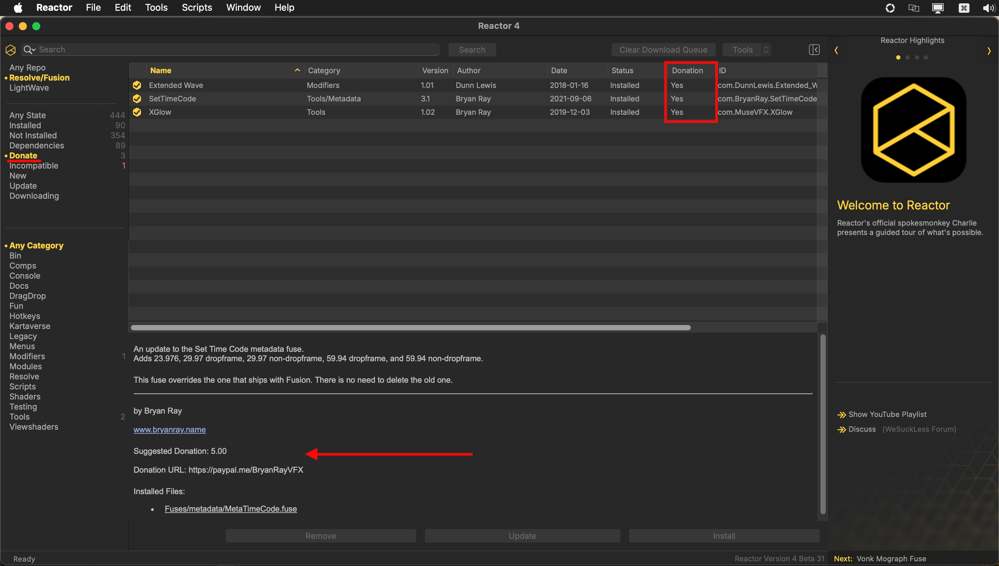

# Reactor Standalone General Usage

## Reactor GUI

Reactor's user interface is divided into the following panel regions:

<ul>
<li><span style="color:#5b5b5b;"><em>Top</em></span> bar</li>
<li><span style="color:#c332d3;"><em>Left</em></span> panel</li>
<li><span style="color:#d6a107;"><em>Right</em></span> panel</li>
<li><span style="color:#2e39e3;"><em>List</em></span> panel</li>
<li><span style="color:#4f9308;"><em>Detail</em></span> panel</li>
<li><span style="color:#188c83;"><em>Actions</em></span> bar</li>
<li><span style="color:#d41b24;"><em>Info</em></span> bar</li>
</ul>


*Image courtesy of WSL member JustCropIt*

Selecting an item in the left panel helps you filter the content that is visible in the List panel view. If you select an atom package in the List panel, the description content is shown in the Detail panel.

Clicking on the checkbox next to the atom package name in the List panel allows you to quickly install/uninstall an item.


If you have an atom package selected, and hold down the shift modifier key it allows you to select several atom packages at the same time.

If you are in a specific category or have used the search controls to narrow down what you are looking at: You can then use the "Edit > Select All" menu item or the Select All hotkey to install all of the items visible in the Details view by clicking the "Install", or "Remove" button in the actions bar. This speeds up package installation greatly.

If you are wondering what is new and noteworthy, the right panel in Reactor has a highlights section. This shows information across several pages about content you can explore.

## HID Input devices

The Reactor Standalone GUI can now be controlled by USB and Bluetooth Gamepad devices like a [Sony DualSense Wireless Controller](https://www.playstation.com/en-us/support/hardware/ps5-button-functions/) or a [Kinesis JoyStick Controller](https://kinesis-ergo.com/shop/jsb-3-pedal/). This makes it super fast to blaze through the atom package listings and install/remove items.

The HID input device support is activated using the "File > Settings..." menu item. In the "Reactor Preferences" window turn on the checkbox next to the option labelled "USB and Bluetooth Gamepad Support".

Note: If you enable the "USB and Bluetooth Gamepad Support" option you will be asked by the macOS "Privacy and Security > Input Monitoring" preference pane if you would like to allow the Reactor Standalone application to monitor input. You can opt to have this "Privacy and Security" setting disabled if you wish. If the "USB and Bluetooth Gamepad Support" checkbox is not active in Reactor you will not be asked this question by macOS.

### Sony DualSense Wireless Controller Button Mappings:

- Directional Up/Down Buttons = Next/Previous Atom Package
- Left Joystick Y-Axis = Next/Previous Atom Package (With analog velocity on scrolling)
- Right Joystick Y-Axis = Scroll Atom Description Webpage View
- Cross Button = Install/Remove Atom Package
- Circle Button = Next Highlights Panel Page
- Triangle Button = Cancel Atom Package Download
- Square Button = Refresh View
- L1/L2 Buttons = Next/Previous Category List
- R1/R2 Buttons = Next/Previous State List


### Xbox Wireless Controller Button Mappings:

- Cross Up/Down Buttons = Next/Previous Atom Package
- A Button = Install/Remove Atom Package
- B Button = Next Highlights Panel Page
- Y Button = Cancel Atom Package Download
- X Button = Refresh View
- LT Buttons = Next Category List
- RT = Previous State List


### Kinesis JoyStick Controller Button Mappings:

- Left Foot Pedal = Previous Atom Package
- Centre Foot Pedal = Install/Remove Atom Package
- Right Foot Pedal = Next Atom Package

### Adding support for more USB/Bluetooth controllers

If you would like to see another gamepad input device supported in Reactor it is possible to send in the device mapping details. This information can be collected using the "Scripts > USB Input Devices" menu item.


This will open an "Input Devices" scanning window. Use the popup menu to select the device you want to profile.


To find out what a controller does, simply activate each control joystick/button input. Then write down the control name aka "Input" that is used. The "State" column shows the value that a control puts out when pressed.


## Reactor Standalone Preferences

The Reactor Standalone preferences are stored in a JSON document.

On macOS the JSON file can be found at:  
`$HOME/Library/Application Support/Reactor/Reactor.json`

On Windows the JSON file can be found at:  
`C:\Users\<Your User Account>\AppData\Roaming\Reactor.json`

On Linux the JSON file can be found at:  
`$HOME/.config/Reactor/Reactor.json`

This folder can be accessed using the "File > Show Settings Folder" menu item in Reactor Standalone.


The Reactor.json file is formatted like:

```
{
    "MainWindow": {
        "Top": 53,
        "Left": 0,
        "Width": 1400,
        "Height": 680
    },
    "LicenseAccepted": true,
    "GamepadSupport": 1,
    "LiveSearch": false,
    "NewForDays": 30,
    "MarkAsNew": true,
    "ReactorInstallPathMap": "/Users/vfx/Reactor/",
    "Repos": {
        "_Core": {
            "Name": "Reactor",
            "Protocol": "GitLab",
            "LocalFile": "Reactor.json",
            "BaseURL": "https://gitlab.com/WeSuckLess/Reactor/-/blob/master/Atoms/",
            "URL": "https://gitlab.com/WeSuckLess/Reactor/-/raw/master/JSON/Reactor.json?ref_type=heads",
            "ZIPFilePrefix": "Reactor-master-Atoms-",
            "Highlights": {
                "Name": "Reactor Highlights",
                "LocalFile": "Highlights.json",
                "URL": "https://gitlab.com/WeSuckLess/Reactor/-/raw/master/JSON/Highlights.json?ref_type=heads"
            }
        }
    }
}
```

If you want to change the location where atom packages are sourced from, you can modify the "Repos / _Core" attributes in the JSON file. Here is an example where Vonk Ultra repo atoms are accessed in Reactor Standalone:

```
{
    "MainWindow": {
        "Top": 53,
        "Left": 0,
        "Width": 1400,
        "Height": 680
    },
    "LicenseAccepted": true,
    "GamepadSupport": 1,
    "LiveSearch": false,
    "NewForDays": 30,
    "MarkAsNew": true,
    "ReactorInstallPathMap": "/Users/vfx/Reactor/",
    "Repos": {
        "_Core": {
            "Name": "Reactor",
            "Protocol": "GitLab",
            "LocalFile": "Reactor.json",
            "BaseURL": "https://gitlab.com/AndrewHazelden/Vonk/-/blob/master/Atoms/",
            "URL": "https://gitlab.com/AndrewHazelden/Vonk/-/raw/master/JSON/Reactor.json?ref_type=heads",
            "ZIPFilePrefix": "Vonk-master-Atoms-"
            "Highlights": {
                "Name": "Reactor Highlights",
                "LocalFile": "Highlights.json",
                "URL": "https://gitlab.com/WeSuckLess/Reactor/-/raw/master/JSON/Highlights.json?ref_type=heads"
            }
        }
    }
}
```

## Reactor URL Link Format

The new Reactor standalone application registers itself system-wide as a custom URL handler for clickable URLs that are formatted as "Reactor:/<AtomID>". This makes installing atom packages a breeze. Simply clicking a Chrome/Firefox/Safari webpage or forum link can automatically launch the Reactor.app program and bring you right to the desired atom package's description.

### Sample Reactor Weblinks

- [Install the KAK Atom Package](Reactor:/com.PieterVanHoute.KAK)  
- [Install the KickAss ShaderZ Atom Package](Reactor:/com.wesuckless.KickAssShaderZ)  
- [Install the KKD Atom Package](Reactor:/com.KomKomDoorn.krokodoveFu19)  

BBCode:

```
[url=Reactor:/com.PieterVanHoute.KAK]Install the KAK Atom Package[/url]
[url=Reactor:/com.wesuckless.KickAssShaderZ]Install the KickAss ShaderZ Atom Package[/url]
[url=Reactor:/com.KomKomDoorn.krokodoveFu19]Install the KKD Atom Package[/url]
```

HTML:

```
<a href="Reactor:/com.PieterVanHoute.KAK">Install the KAK Atom Package</a>
<a href="Reactor:/com.wesuckless.KickAssShaderZ">Install the KickAss ShaderZ Atom Package</a>
<a href="Reactor:/com.KomKomDoorn.krokodoveFu19">Install the KKD Atom Package</a>
```

Markdown:

```
[Install the KAK Atom Package](Reactor:/com.PieterVanHoute.KAK)
[Install the KickAss ShaderZ Atom Package](Reactor:/com.wesuckless.KickAssShaderZ)
[Install the KKD Atom Package](Reactor:/com.KomKomDoorn.krokodoveFu19)
```

## Reactor TIPS

### Reactor App Store Compatibility

If you are using Resolve (Free) downloaded from the Apple App Store, the previous Reactor installation path was:

    /Users/<Your User Account>/Library/Containers/com.blackmagic-design.DaVinciResolveLite/Data/Library/Application Support/Fusion/Reactor/

### Atom Selection Options

Multi-selections are possible in the Reactor "List Panel" by clicking on a row then holding down the SHIFT modifier key. Pressing the "Install" button will then install the actively selected nodes. You can also press the Select All hotkey (Command + A on macOS) to select all of the atoms in the current atom category.


### Manage your Donations

There is a "Donate" view option that can be selected from the popup menu at the top-left of the user interface. This shows the atom packages you have installed that ask you to consider making a donation. The Reactor "Detail panel" lists the suggested donation amount and donation URL.


