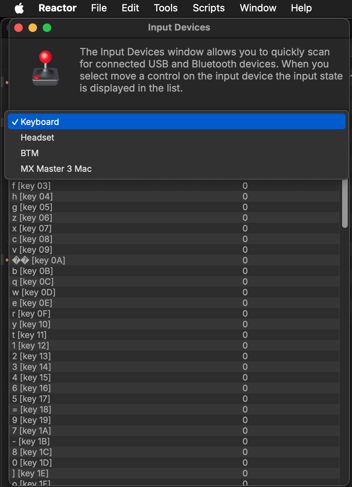
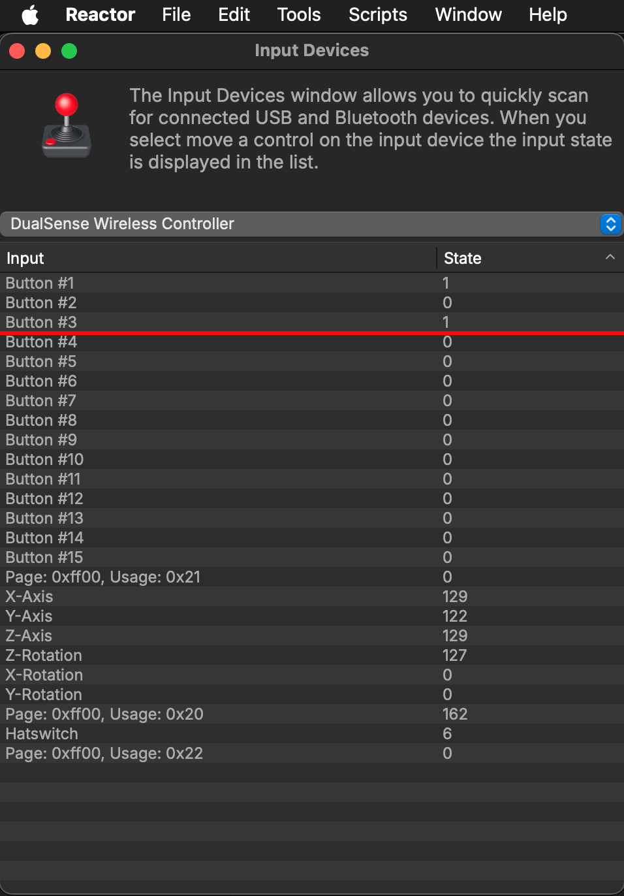

# Reactor Hotkeys

Reactor supports the use of the following hotkeys:

- Select all atoms in List panel (Control/Command + A)
- Remove selected atom package in List panel (Delete/Backspace)
- Refresh List panel (Control/Command + R)
- Open Console window (Shift + 0)
- Open Preferences window (Control/Command + ,)
- Open Atomz List File (Control/Command + O)
- Save Atomz List File (Control/Command + S)

## Drag and Drop Handling

In addition to using hotkeys, you can also use drag & drop approaches to drag an Atoms list file (.lst) document from your desktop folder onto the Reactor icon. Reactor will then offer to install the list of favorite packages. This makes it quick to sync the same atoms between local and remote computers.

## HID Input devices

The Reactor Standalone GUI can now be controlled by USB and Bluetooth Gamepad devices like a [Sony DualSense Wireless Controller](https://www.playstation.com/en-us/support/hardware/ps5-button-functions/) or a [Kinesis JoyStick Controller](https://kinesis-ergo.com/shop/jsb-3-pedal/). This makes it super fast to blaze through the atom package listings and install/remove items.

The HID input device support is activated using the "File > Settings..." menu item. In the "Reactor Preferences" window turn on the checkbox next to the option labelled "USB and Bluetooth Gamepad Support".

Note: If you enable the "USB and Bluetooth Gamepad Support" option you will be asked by the macOS "Privacy and Security > Input Monitoring" preference pane if you would like to allow the Reactor Standalone application to monitor input. You can opt to have this "Privacy and Security" setting disabled if you wish. If the "USB and Bluetooth Gamepad Support" checkbox is not active in Reactor you will not be asked this question by macOS.

### Sony DualSense Wireless Controller Button Mappings:

- Directional Up/Down Buttons = Next/Previous Atom Package
- Left Joystick Y-Axis = Next/Previous Atom Package (With analog velocity on scrolling)
- Right Joystick Y-Axis = Scroll Atom Description Webpage View
- Cross Button = Install/Remove Atom Package
- Circle Button = Next Highlights Panel Page
- Triangle Button = Cancel Atom Package Download
- Square Button = Refresh View
- L1/L2 Buttons = Next/Previous Category List
- R1/R2 Buttons = Next/Previous State List

### Xbox Wireless Controller Button Mappings:

- Cross Up/Down Buttons = Next/Previous Atom Package
- A Button = Install/Remove Atom Package
- B Button = Next Highlights Panel Page
- Y Button = Cancel Atom Package Download
- X Button = Refresh View
- LT Buttons = Next Category List
- RT = Previous State List

### Kinesis JoyStick Controller Button Mappings:

- Left Foot Pedal = Previous Atom Package
- Centre Foot Pedal = Install/Remove Atom Package
- Right Foot Pedal = Next Atom Package

### Adding support for more USB/Bluetooth controllers

If you would like to see another gamepad input device supported in Reactor it is possible to send in the device mapping details. This information can be collected using the "Scripts > USB Input Devices" menu item.

This will open an "Input Devices" scanning window. Use the popup menu to select the device you want to profile.

To find out what a controller does, simply activate each control joystick/button input. Then write down the control name aka "Input" that is used. The "State" column shows the value that a control puts out when pressed.

