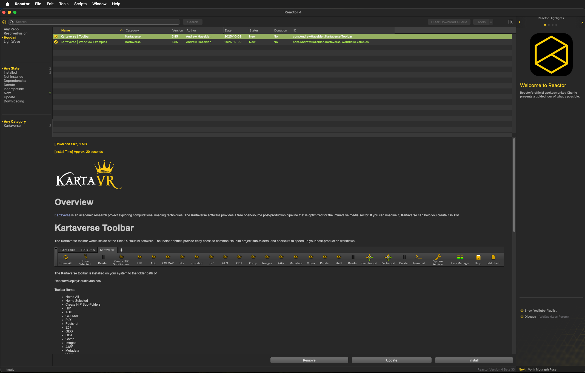
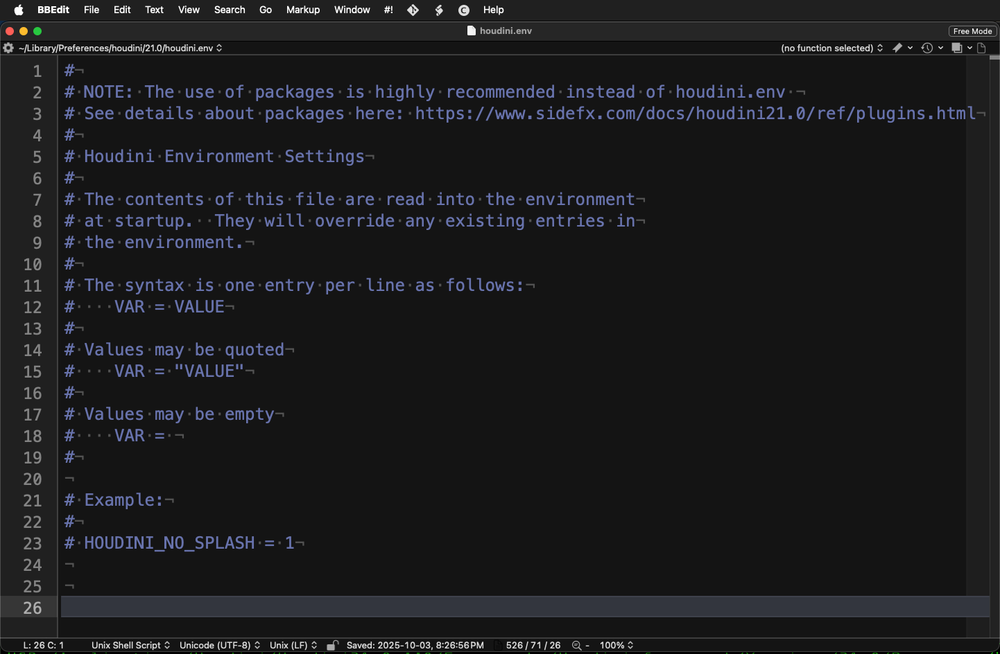

# Reactor for Houdini Usage

Reactor Standalone now supports SideFX Houdini 21.0. You can access Houdini compatible packages in Reactor Standalone by clicking on the word "Houdini" that is accessible at the top of the Left Panel.

The GitLab repository that hosts the Reactor for Houdini atom packages is located at:  
[https://gitlab.com/WeSuckLess/Reactor-for-Houdini](https://gitlab.com/WeSuckLess/Reactor-for-Houdini)

## Screenshot



## Reactor Downloads Folder

With Reactor 4, the default "Reactor" folder location has changed so it points to the content that is stored in your user account's home folder at:

`$HOME/Reactor/`

Reactor Standalone downloads the SideFX compatible content to the sub-folder located at:

`Reactor:/DeployHoudini/`

On Windows this means the HOUDINI_PATH env var is typically set to include:  
`C:\Users\<Your User Account>\Reactor\DeployHoudini\houdini\XX.Y\`

On macOS this means the HOUDINI_PATH env var is typically set to include:  
`/Users/<Your User Account>/Reactor/DeployHoudini/houdini/XX.Y/`

On Linux this means the HOUDINI_PATH env var is typically set to include:  
`/home/<Your User Account>/Reactor/DeployHoudini/houdini/XX.Y/`

## Connecting Reactor to Houdini

The [Houdini documentation](https://www.sidefx.com/docs/houdini/basics/config_env.html) covers the process of editing environment variables through the use of a "houdini.env" file.




Reactor for Houdini usage requires you to manually edit the "houdini.env" file to add the Reactor "DeployHoudini" folder path to the "HOUDINI_PATH" environment variable. If you have Reactor set to download content to your user account's home folder in a subdirectory named "Reactor", then you would edit the Houdini.env file to append the following details to the text file:

(Information Still Being Validated)

Windows:

```
REACTORTREE=$USERPROFILE/Reactor/DeployHoudini/houdini
HOUDINI_PATH=$REACTORTREE\21.0;&
```

macOS:

```
REACTORTREE=$HOME/Reactor/DeployHoudini/houdini
HOUDINI_PATH=$REACTORTREE/21.0:&
```

Linux:

```
REACTORTREE=$HOME/Reactor/DeployHoudini/houdini
HOUDINI_PATH=$REACTORTREE/21.0:&
```
