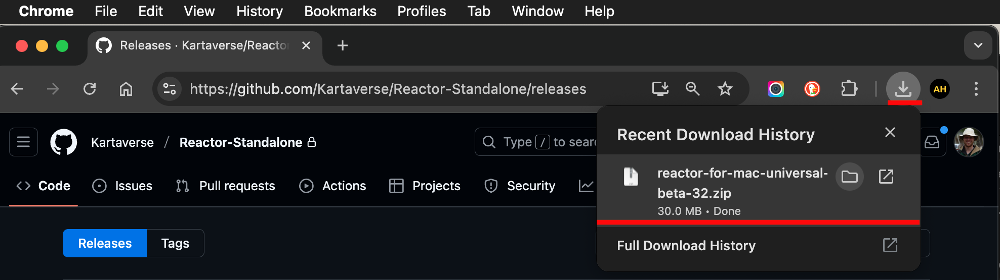
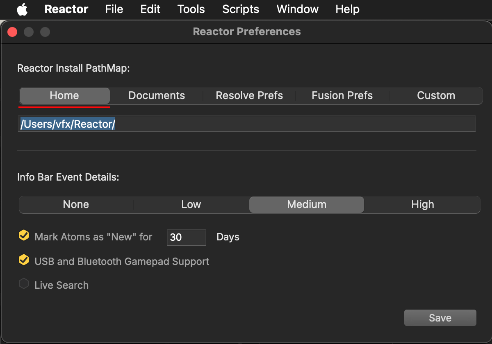

# Reactor Standalone Installation

Reactor is provided as a zip-based portable install. You can technically expand the zip archive, and run the Reactor Standalone program's executable from any location you desire. 

However it's recommended for new users to copy the software into your Applications/Program Files folder for simplicity.

# Downloads

You can download the latest Reactor Standalone beta releases from the project's [GitHub Releases page](https://github.com/Kartaverse/Reactor-Standalone/releases).


Note: Click on the "Assets" section for the GitHub release to expand the file download section.

The Assets downloads are separate files per-operating system.  You will see the zip archives listed with filename that looks roughly like this:

- reactor-for-linux-x64-v4-beta-23.zip
- reactor-for-mac-universal-v4-beta-23.zip
- reactor-for-win-x64-v4-beta-23.zip

# Installing Reactor

## macOS Install

1. Download the macOS compatible Zip archive with a name like `reactor-for-mac-universal-v<Version Number>.zip`.



2. Expand this zip archive in your Downloads folder. Open up the newly created `reactor-for-mac-universal-v<Version Number>` folder. You will see a "Reactor.app" executable, along with usage documentation in a "Docs" folder, and other resources like custom fonts you can install.


3. Copy the "Reactor.app" file into your Applications folder. This will result in Reactor being installed to:  
`/Applications/Reactor.app`.


4. To launch Reactor, double click on the "Reactor.app" application icon to start the software. The macOS gatekeeper system will ask you if you want to run the application the first time you launch it.


When Reactor is running, you can add the program's icon to your macOS docs if you would like to make the program more accessible for future use. This is done by right-clicking on the program's icon, navigate in the pop-up contextual menu to the "Options -> Keep in Dock" menu item.


## Windows Install

1. Download the Windows compatible Zip archive with a name like `reactor-for-win-x64-v<Version Number>.zip`.

2. Expand this zip archive in your Downloads folder. Open up the newly created `reactor-for-win-x64-v<Version Number>` folder. You will see a "Reactor" folder that holds the Reactor Standalone executables, along with usage documentation in a "Docs" folder, and other resources like custom fonts you can install.

3. Copy the "Reactor" folder to your Program Files folder. This will result in the Reactor executable being installed to:  
`C:\Program Files\Reactor\Reactor.exe`.

If you store your programs on another hard drive, copy the "Reactor" folder to that location instead.

4. Double-click on the "Reactor.exe" executable inside the Reactor folder to launch the program. When Reactor is running, you can add the program's icon to your Windows taskbar if you would like to make the program more accessible for future use.

## Linux Install

1. Download the Linux compatible Zip archive with a name like `reactor-for-win-x64-v<Version Number>.zip`.

2. Expand this zip archive in your Downloads folder. Open up the newly created `reactor-for-win-x64-v<Version Number>` folder. You will see a "Reactor" folder that holds the Reactor Standalone executables, along with usage documentation in a "Docs" folder, and other resources like custom fonts you can install.

3. Copy the "Reactor" folder to your /opt/ folder. This will result in Reactor being installed to:  
`/opt/Reactor/Reactor`. For convenience there is a `/opt/Reactor/Reactor Standalone.desktop` shortcut  file available.

If you store your programs on another hard drive, copy the "Reactor" folder to that location instead.

4. Run the `/opt/Reactor/Reactor` executable, or use the `/opt/Reactor/Reactor Standalone.desktop` desktop shortcut.

Note: If you want to see diagnostic output, launch the Reactor executable from a Terminal window. Status information from Reactor will be printed to the Terminal as the program is used.


## Linking Reactor to Resolve/Fusion

After you run Reactor and accept the license terms, go to Reactor's "File > Connect Reactor to Fusion…" menu item.


Follow the instructions in this dialog to make the Reactor downloaded content show up inside of DaVinci Resolve/Fusion.


Click the "Create Script" button. A file named "Reactor Setup.lua" will be created on your computer's desktop folder. Open this folder up in a desktop folder browsing window.

Start the Davinci Resolve/Fusion program. Navigate into an existing editing project. Then open up the "Workspace > Console" menu item.


The Console window will appear.


This Console is the view where Lua and Python scripts can be run, by dragging them from the Desktop folder into the Console window. Drag the "Reactor Setup.lua" Lua script file from your desktop folder into the Console window to run it.


You may have to re-open the Console window again after running the scripts to see the result. 
If the setup process was successful the Console window will show the following message:


```
[Connect Reactor to Fusion]
[Reactor: PathMap] '/Users/vfx/Reactor/'
Reactor is now connected, restart Resolve/Fusion to finish the installation.
```

Quit DaVinci Resolve/Fusion. Then re-launch the software. You should now have Kartaverse installed on your system. 

The "Reactor Setup.lua" script created what is called a Fusion Pathmap setting that tells DaVinci Resolve where to find the Reactor content. It points the PathMap shortcut called "Reactor:" to the location on the disk where the files were downloaded to.

If you want to see where the PathMap setting was configured in the program's settings, open up DaVinci Resolve's Fusion page. Navigate to the "Fusion > Fusion Settings…" menu.


Then on the left sidebar select the "PathMap" entry. Scroll down in the main part of the view to the bottom of the list. You will see the User section where the "Reactor:" entry is defined. Also in the "UserPaths:", and "Scripts:" sections of the dialog the Reactor entry is referenced.


# Uninstalling Reactor

## macOS Uninstall

1. Quit the Reactor app, and Resolve/Fusion. Then throw out the Reactor preferences.

On macOS the JSON preference file can be found at:  
`$HOME/Library/Application Support/Reactor/Reactor.json`

2. Delete the Reactor content folder. On macOS this location is typically:  
`/Users/<Your User Account>/Reactor/`

3. Drag the "Reactor.App" file from your applications folder into the trash can.

## Win Uninstall

1. Quit the Reactor app, and Resolve/Fusion. Then throw out the Reactor preferences.

On Windows the JSON preference  file can be found at:  
`C:\Users\<Your User Account>\AppData\Roaming\Reactor.json`

2. Delete the Reactor content folder. On Windows this location is typically:  
`C:\Users\<Your User Account>\Reactor\`

3. Drag the "Reactor" Program Files folder into the recyling bin.

## Linux Uninstall

1. Quit the Reactor app, and Resolve/Fusion. Then throw out the Reactor preferences.

On Linux the JSON preference file can be found at:  
`$HOME/.config/Reactor/Reactor.json`

2. Delete the Reactor content folder. On Linux this location is typically:  
`/home/<Your User Account>/Reactor/`

3. Drag the "Reactor" program folder from the "/opt/Reactor/" location into the trash can.


# Reactor Content Folder

When Reactor Standalone downloads content, it stores the files on disk in your home folder by default in a sub-folder with the name "Reactor". The reason this is done is it means the same content can be made accessible to DaVinci Resolve, Fusion Studio, and Fusion Render Node.

The home folder was chosen as it is not in a hidden directory, and the user as disk permissions to write files where without needing to take on administrator/sudo privileges.

This is what the Reactor content folder looks like in a typical usage scenario:


Inside of Fusion, the "Reactor:" PathMap folder entry has been updated compared to prior Reactor releases, so it now points to the content that is stored your user account's home folder at:

`$HOME/Reactor/`

On macOS this location is typically:  
`/Users/<Your User Account>/Reactor/`

On Windows this location is typically:  
`C:\Users\<Your User Account>\Reactor\`

On Linux this location is typically:  
`/home/<Your User Account>/Reactor/`

# Customizing the Reactor Installation Location

The Reactor "File > Settings..." (macOS) and "File > Preferences" (Win/Linux) menu can be used to change the Reactor content install location on your hard disk.


You will likely want to keep Reactor's "Reactor Install PathMap" setting at either "Home" or to set the control to "Custom" and enter a custom filepath you wish to use.



Keep in mind you need to have write permissions to the folder where you want Reactor to save the content to. If you do not have disk write permissions you will see error messages in the Reactor dialog when changing the settings. If you get locked out of Reactor from this action you will need to either edit the Reactor JSON preference file to modify the location or remove the JSON file to reset it back to the defaults.