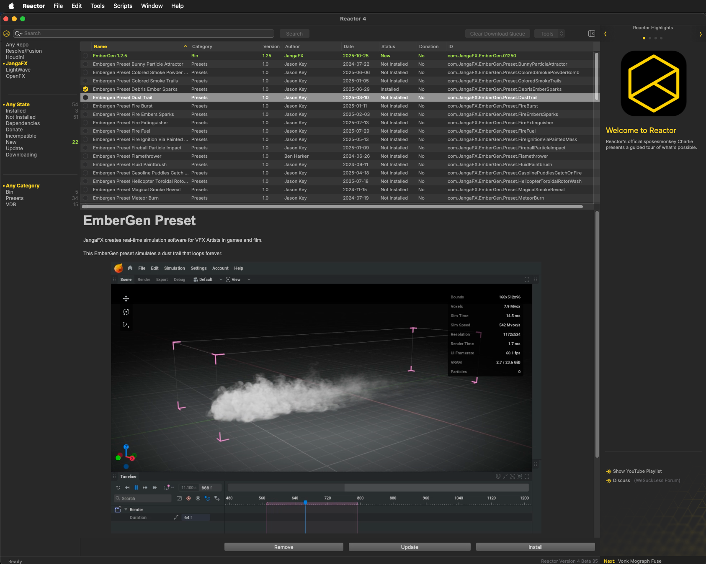

# Reactor for JangaFX Usage

[JangaFX](https://jangafx.com/) creates real-time simulation software like EmberGen, LiquiGen, GeoGen, and IlluGen. These tools are used by VFX Artists in games and film.

Reactor Standalone now supports the installation of JangaFX content like presets, meshes, OpenVDB caches, HDRIs, and heightmaps. You can access JangaFX compatible packages in Reactor Standalone by clicking on the word "JangaFX" that is accessible at the top of the Left Panel.

The GitLab repository that hosts the Reactor for JangaFX atom packages is located at:  
[https://gitlab.com/WeSuckLess/Reactor-for-JangaFX](https://gitlab.com/WeSuckLess/Reactor-for-JangaFX)

## Screenshot

## Reactor Downloads Folder

With Reactor Standalone, the default "Reactor" folder location has changed so it points to the content that is stored in your user account's home folder at:

`$HOME/Reactor/`

Reactor Standalone downloads the JangaFX compatible content to the sub-folder located at:

`$HOME/Reactor/DeployJangaFX/`
