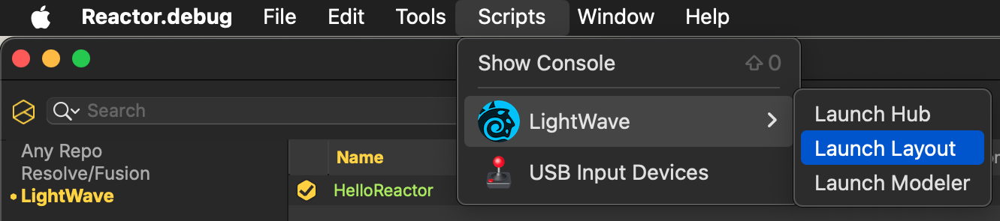

# LightWave Usage

One of the new additions arriving with Reactor Standalone v4 is the creation of a GitLab hosted LightWave atom package repository:

[https://gitlab.com/WeSuckLess/reactor-for-lightwave](https://gitlab.com/WeSuckLess/reactor-for-lightwave)

This is part of an effort to support LightWave content installation using atom packages. The LightWave compatible material is downloaded by Reactor Standalone and saved to the folder:

```
Reactor:/DeployLW/
```

## Connecting Reactor to LightWave

Use the Reactor Standalone "Scripts > LightWave > ..." menu item to access the LightWave launcher shortcuts.



## LightWave CLI Parameters

Included with Reactor are several pre-made LightWave launcher shortcuts that you can customize as needed. Editing the shortcut files allows you relink the launcher shortcuts to point at a different LightWave release.

### macOS Launchers

- /Applications/Reactor.app/Contents/Resources/Hub_Reactor.command
- /Applications/Reactor.app/Contents/Resources/Layout_Reactor.command
- /Applications/Reactor.app/Contents/Resources/Modeler_Reactor.command

### Windows Launchers

- C:\Program Files\Reactor\Reactor Resources\Hub_Reactor.lnk
- C:\Program Files\Reactor\Reactor Resources\Layout_Reactor.lnk
- C:\Program Files\Reactor\Reactor Resources\Modeler_Reactor.lnk

### Custom LightWave Plugin Folders

When you start LightWave, the software allows you to specify the location of 3rd party plugin folder by entering the "-p" command-line flag followed by a folder locaton.


Shortcut Target Filepath Examples:

```
"C:\Program Files\LightWaveDigital\LightWave_2025.0.2\bin\Modeler.exe" -p%USERPROFILE%\Reactor\DeployLW
```

```
"C:\Program Files\LightWaveDigital\LightWave_2025.0.2\bin\Layout.exe" -p%USERPROFILE%\Reactor\DeployLW
```

```
"C:\Program Files\LightWaveDigital\LightWave_2025.0.2\bin\Hub.exe" -p%USERPROFILE%\Reactor\DeployLW
```
