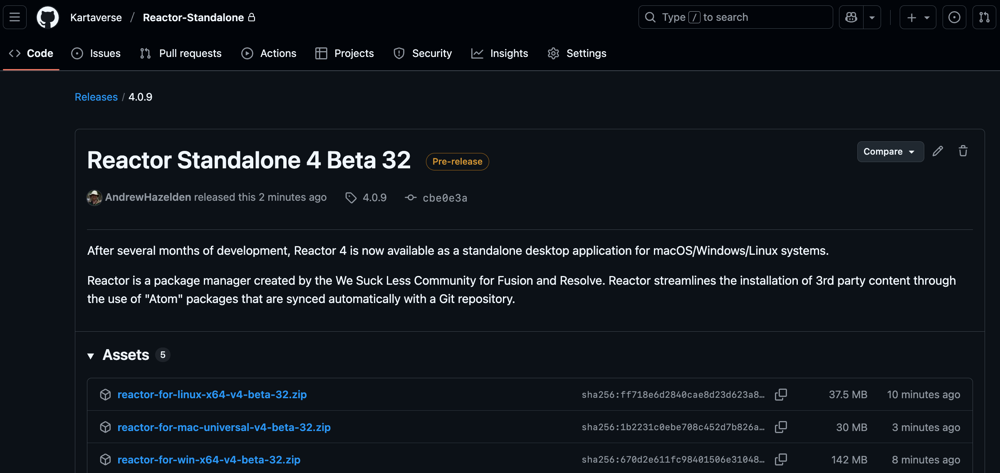

# Reactor Standalone for Resolve/Fusion

Reactor 4 Beta Build 27 - 2025-09-22  

## Overview

Reactor is a package manager created by the [We Suck Less Community](https://www.steakunderwater.com/wesuckless/viewforum.php?f=32) for Fusion and Resolve. Reactor streamlines the installation of 3rd party content through the use of "Atom" packages that are synced automatically with a Git repository.

The Reactor Package Manager has been revamped as a desktop application that works seamlessly on macOS, Windows, and Linux.

## Table of Contents

- [Installation](Install.md)
- [Fusion Usage](FusionUsage.md)
- [LightWave Usage](LightWaveUsage.md)
- [Beta Notes](BetaNotes.md)
- [Change Log](ChangeLog.md)

## Downloads

You can download the latest Reactor Standalone beta releases from the project's [GitHub Releases page](https://github.com/Kartaverse/Reactor-Standalone/releases).

Note: Click on the "Assets" section for the GitHub release to expand the file download section.

## Special Thanks Credits

Reactor as it exists today would not be possible without the assistance of the following people:

Pieter Van Houte, Andrew Hazelden, JustCropIt, Mathieu Reygaerts, Jacob Danell, Sander De Regt, Charlie, Dunn Lewis, Movalex, Raf Schoenmaekers, Kristof, Cédric, SirEdric, AndromedaGirl, Grant Petty, Steve Roberts, Daniel Koch, Peter Loveday, Rohit Gupta, and Peter Chamberlain
