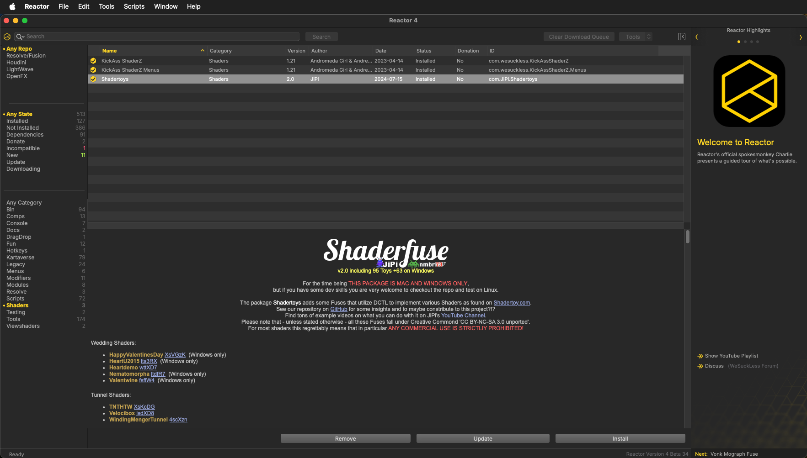

# Reactor Standalone for Resolve/Fusion

Reactor 4 Beta Build 33 - 2025-10-09  

## Overview

Reactor is a package manager created by the [We Suck Less Community](https://www.steakunderwater.com/wesuckless/viewforum.php?f=32) for BMD Fusion Studio, Resolve (Free), Resolve Studio, Houdini, and LightWave. Reactor streamlines the installation of 3rd party content through the use of "Atom" packages that are synced automatically with a Git repository.

The Reactor Package Manager has been revamped as a desktop application that works seamlessly on macOS, Windows, and Linux.

## Table of Contents

- [Installation](Install.md)
- [Fusion Usage](FusionUsage.md)
- [Houdini Usage](HoudiniUsage.md)
- [LightWave Usage](LightWaveUsage.md)
- [Hotkeys](Hotkeys.md)
- [Beta Notes](BetaNotes.md)
- [Change Log](ChangeLog.md)

## Downloads

You can download the latest Reactor Standalone beta releases from the project's [GitHub Releases page](https://github.com/Kartaverse/Reactor-Standalone/releases).

Note: Click on the "Assets" section for the GitHub release to expand the file download section.

## Special Thanks Credits

Reactor as it exists today would not be possible without the assistance of the following people:

Pieter Van Houte, Andrew Hazelden, JustCropIt, Mathieu Reygaerts, Jacob Danell, Sander De Regt, Charlie, Dunn Lewis, Movalex, Raf Schoenmaekers, Kristof, Cédric, Bryan Ray, SirEdric, AndromedaGirl, Grant Petty, Steve Roberts, Daniel Koch, Peter Loveday, Rohit Gupta, and Peter Chamberlain

## Content Repositories

Reactor Standalone downloads atom packaged content from GitLab repos. You can view the individual atom files on the official repos here:

- [Reactor for Fusion](https://gitlab.com/WeSuckLess/Reactor)
- [Reactor for Houdini](https://gitlab.com/WeSuckLess/Reactor-for-Houdini)
- [Reactor for LightWave](https://gitlab.com/WeSuckLess/Reactor-for-LightWave)

## Development To-Do List

The following features will be completed before the official release ships:

- Speed up Reactor startup times for the initial syncing. Right now it can take 5 to 10 seconds on a Windows PC for Reactor to launch. Maybe a startup progress dialog would be useful.
- Improve Windows download queue task handling with synchronous downloads. Right now asynchronous downloads are used at a per-atom file transfer level which is blocking and reduces the interactivity of the UI. This results in the Reactor Standalone for Windows release feeling laggier than the macOS and Linux builds.
- It's helpful to be running your OS in "Dark Mode" if you are looking at the Reactor Standalone app's "Preference" window in the current beta builds. I am working on adjusting the text color in this window to solve the contrast issues.
- The "Update" button code will be improved in an upcoming build. Right now clicking the "Update" button in the actions bar zone will update all of the atom packages that are not in version. The next release will move it to updating only the currently selected atoms in the List panel.
