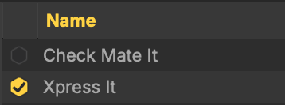
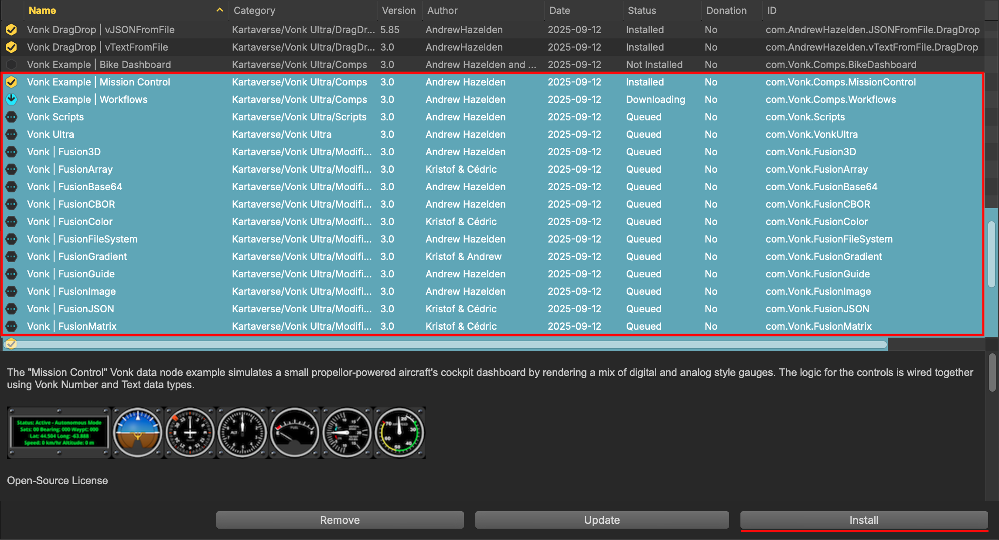

# Reactor Essentials

## Reactor GUI

Reactor's user interface is divided into the following panel regions:

<ul>
<li><span style="color:#5b5b5b;"><em>Top</em></span> bar</li>
<li><span style="color:#c332d3;"><em>Left</em></span> panel</li>
<li><span style="color:#d6a107;"><em>Right</em></span> panel</li>
<li><span style="color:#2e39e3;"><em>List</em></span> panel</li>
<li><span style="color:#4f9308;"><em>Detail</em></span> panel</li>
<li><span style="color:#188c83;"><em>Actions</em></span> bar</li>
<li><span style="color:#d41b24;"><em>Info</em></span> bar</li>
</ul>


*Image courtesy of WSL member JustCropIt*

### Left Panel

The left panel has controls for changing the software "Repo" (GitLab Repository) that is displayed, filtering the content based upon its "State" (like if the package is installed, or updates exist), and for the "Category" of the content. The numbers show to the right of the State and Category entries show you the number of items that match that filter.

Selecting an item in the left panel helps you filter the atom packaged content that is visible in the List panel view.


#### Repo Section

At the top of left panel is the "Repo" (Repository) selection. This is the primary control that changes the type of content you you see in the list panel. Each supported application in Reactor downloads content from a separate repository.

For example, if you want to see content that works with Resolve (Free), Resolve Studio, or Fusion Studio you would select the "Resolve/Fusion" repo entry.


#### State Section

The "State" section provides the ability to see packages that match a parameter like if it is installed, not installed, there are donations requested, something is new to reactor, updates exist for an installed packages, or items are being downloaded.


#### Category Section

The "Category" section allows you to filter the display of packages by the type of content you wish to see. This categorization is a classification of what the package is used for, with the intent of helping streamline the discovery process.

For the Resolve/Fusion repository you would look under the "Tools" section to see macros, fuses, and plugins. Python and Lua scripts would appear under the "Scripts" heading.


## List Panel

The list panel at the top center of the Reactor window is where the individual atom packages you can install are listed. The first cell on a row has an install/uninstall checkbox, followed by details about the package. Clicking on the text for a row will display more information about the package in the detail panel.


There are several heading rows that let you sort the list contents by attributes such as "Name", "Category", "Version", "Author", "Date", "Status", "Donation", and "ID". Clicking on the heading will flip the sorting between ascending/descending alphabetical order.

Clicking on the hexagonal shaped checkbox next to the atom package name in the List panel allows you to quickly install/uninstall an item. When the item is queued for download, downloading, and installing you will see an animated status icon. When the item is installed you will see a checkmark symbol.



If you have an atom package selected, and hold down the shift modifier key it allows you to select several atom packages at the same time which is called a "multi-selection".

You can also use the "Edit > Select All" menu item or press the "Select All" hotkey (Command + A) on macOS, or (Control + A) on Windows/Linux to select all of the atoms in the current atom category.



Pressing the "Install" button will then install the actively selected items. This will tell Reactor to start downloading and installing each of the selected packages in an automated fashion. This approach speeds up package installation greatly.


If you select several atom packages, and press the "Remove" button those items will be removed at the same time. Additionally, when one or more installed packages are selected you have the option of pressing the "Delete" or "Backspace" keys on your keyboard to uninstall them.

## Detail panel

The detail panel is where you see the atom package description for the currently selected item in the list panel. You will typically see several paragraphs of text that let you know more about a package, followed by links for more information, and a list of the files that will be installed. 
If a donation is requested by the package author that amount will be shown.


In the "Installed Files" section, clicking on one of the files by name will take you to the exact document in the GitLab repo. This lets you check the contents of any document you are considering installing.


If an atom package relies on another atom package to function, those requirements will be listed in the "Dependencies" section with the ID code for each atom listed. These dependencies will be installed automatically.

```
Dependencies:
  com.AndrewHazelden.HypertextCompositor
  com.HouseOfSecrets.hos_Tiler
  com.StefanIhringer.XfChroma
  com.wesuckless.KickAssShaderZ.Menus
  com.wesuckless.Switch
  com.wesuckless.SwitchElse
  com.wesuckless.Time3D
  com.wesuckless.Wireless
  com.wesuckless.Wireless3D
  com.wesuckless.Wireless3DMat
```

## Top bar

The top bar has a search field that allows to you look for atom packages based upon keywords, or filenames. Clicking the "Search" button will causes the search to be performed.

The "Clear Download Queue" button allows you to cancel the active downloads that are in-progress. This will remove the pending tasks from the "Downloading" state section in the left panel. If multiple packages are being downloaded with linked atom dependencies, you may have to click the "Clear Download Queue" button again.


## Actions bar

The actions bar holds the atom package "Install", "Update", and "Remove" buttons. These buttons operate on the active selection in the list panel.


## Info bar

The Info bar region shows program status information. This allows you to monitor the download and installation of atom packaged content. A colored progress bar is visible when a download is in progress.

On the far right side of the Info bar the current version details are shown for the Reactor Standalone software. If you click on the version details the "About Reactor" window is shown.


## Right panel

The right panel has a highlights section that shows what is new and noteworthy in Reactor. You can cycle through the news feed items using the left and right arrows at the top of the panel, or you can click the "Next: Item" section at the bottom of the view. Each news item has several links you can use to see related content.


## Usage Tips

### Manage your Donations

There is a "Donate" view option that can be selected from the popup menu at the top-left of the user interface. This shows the atom packages you have installed that ask you to consider making a donation. The Reactor "Detail panel" lists the suggested donation amount and donation URL.


